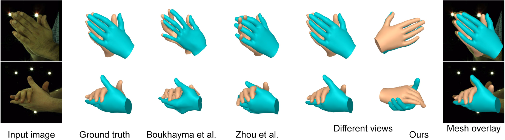

# Interacting Two-Hand 3D Pose and Shape Reconstruction from Single Color Image

This repository contains the model of our paper "Interacting Two-Hand 3D Pose and Shape Reconstruction from Single Color Image".

[Project page](https://baowenz.github.io/Intershape/)



# Installation:
Our code is tested with Cuda 11.1.
## 1.Clone this repository.
```
git clone https://github.com/BaowenZ/Two-Hand-Shape-Pose.git
cd Two-Hand-Shape-Pose
```
The cloned folder is called `${TWO_HAND}`.
## 2.Install dependencies
```
conda create -n intershape python=3.9
conda activate intershape
pip install --upgrade pip
pip install -r requirements.txt -f https://download.pytorch.org/whl/torch_stable.html
```
## Download models
Download pre-trained model [model.pts]() and put it into folder `model/`.

Download the MANO model files from [MANO](https://mano.is.tue.mpg.de/). Unzip `mano_v1_2.zip` under `${TWO_HAND}` and rename the unzipped folder as `mano/`.

## Running the code
```
python test.py --test_folder test_data --model_path model/model.pts
```
Our model predicts hand meshes from images in `test_data/`. The estimated meshes are saved as obj files in `test_data/`.
Samples in `test_data/` are from [InterHand2.6M](https://mks0601.github.io/InterHand2.6M/). We thank for their excellent works.
